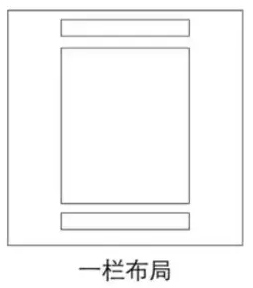
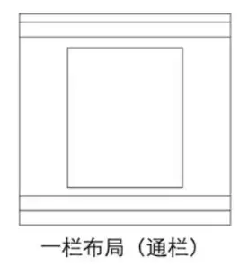

# CSS常见布局
## 单列布局
单列布局按照header、footer和content是否等宽分为：
* 一栏布局
* 一栏布局（通栏）   
### 一栏布局   
   
header、content、footer等宽的单列布局。   
代码实现：   
```css
.header, .content, .footer {
    width: 960px;
    /* 也能使用max-width: 960px; 使用max-width的话，当窗口宽度小于960px时，不会显示滚动条，而是保持窗口宽度 */
    margin: 0 auto;
}
```
### 一栏布局（通栏）
   
header与footer等宽，content略窄的单列布局。   
代码实现：   
```css
/* header,footer不设置宽度，块级元素填充整个宽度 */
.content {
    width: 960px;
    margin: 0 auto;
}
```

## 两列自适应布局
指一列由内容撑开（侧边栏），另一列填满剩余宽度的布局   
```html
<div class="parent">
    <div class="left">
    </div>
    <div class="right">
    </div>        
</div>
``` 
### Float+overflow
通过overflow触发BFC,而BFC不会重叠浮动元素   
代码实现：   
```css
.left {
    float: left;
    width: 100px;
}
.right {
    overflow: hidden;
}
```   
### Flex实现
代码实现：     
```css
.parent {
  display: flex;
}  
.right {
  margin-left: 20px; 
  flex: 1;
}
```   
### Grid实现
```css
.parent {
  display: grid;
  grid-template-columns: auto 1fr;
  grid-gap: 20px
}
```

## 三栏布局
中间列自适应，旁边两列固定宽   
### 圣杯布局
比较特殊的三栏布局，也是中间列自适应，两边固定宽度。但是区别是dom结构必须是先写中间，再写两边，这样可以实现中间列优先加载。   
```html
<div class="container">
    <div class="center"></div>
    <div class="left"></div>
    <div class="right"></div>
</div>
```   
实现步骤：   
1. 三个部分都设置为左浮动，然后设置center的宽度为100%（实现中间列自适应）；
2. 通过设置margin-left为负值来让left和right回到与center同一行；
3. 通过设置父容器的padding，让左右两边留出间隙；
4. 通过相对定位，让left和right部分位于左右两侧。
```css
.container {
    padding-left: 220px;
    padding-right: 220px;
}
.center {
    float: left;
    width: 100%;
}
.left {
    float: left;
    width: 200px;
    margin-left: -100%;
    position: relative;
    left: -220px;
}
.right {
    float: left;
    width: 200px;
    margin-left: -200px;
    position: relative;
    right: -220px;
}
```   
缺点：   
* content部分的宽度小于left宽度时候，会出现布局错乱   
* 如果其中一列的高度过长，其他两列并不会自动填充。（可用等高布局解决）   
### 双飞翼布局
实现了和圣杯布局相同的效果，但是解决了布局混乱问题。   
不过缺点是多了一层dom
```html
<div class="container">
    <div class="center">
        <div class="inner"></div>
    </div>
    <div class="left"></div>
    <div class="right"></div>
</div>
```   
```css
.center {
    float: left;
    width: 100%;
}
.inner {
    margin: 0 200px;
}
.left {
    float: left;
    width: 200px;
    margin-left: -100%;
}
.right {
    float: left;
    width: 200px;
    margin-left: -200px;
}
```   

## 等高布局
指子元素在父元素中高度相等的布局方式   
### 正padding+负margin
设置一个大数值的 padding-bottom，再设置相同数值的负的 margin-bottom，并在所有列外面加上一个容器，并设置 overflow:hidden 把溢出背景切掉。   
使用这个方法可以解决圣杯布局中的不等高问题。   
```css
.center, .left, .right {
    padding-bottom: 10000px;
    margin-bottom: -10000px;
}
.container {
    padding-left: 220px;
    padding-right: 220px;
    overflow: hidden;
}
```   
### 背景图片
使用一张图片，并在y轴方向上repeat，造成背景延申的假象
### Flex实现
将包含等高布局div的父div设置为flex布局，再设置align-items：stretch即可（元素被拉伸以适应容器）
### 表格布局
很简单，也易于实现，但是兼容性不太好，在ie6-7上无法正常运行

## 粘连布局
有一块内容main，当main的高康足够长的时候，紧跟在main后面的元素footer会跟在main元素的后面   
当main元素比较短的时候(比如小于屏幕的高度),我们期望这个footer元素能够“粘连”在屏幕的底部   
实现步骤：   
1. footer必须是一个独立的结构，与wrap没有任何嵌套关系   
2. wrap区域的高度通过设置min-height，变为视口高度   
3. footer要使用margin为负来确定自己的位置   
4. 在main区域需要设置 padding-bottom。这也是为了防止负 margin 导致 footer 覆盖任何实际内容   

# BFC与IFC
## BFC
块级格式化上下文，BFC也是一种布局方式，但是相对于以上的布局，它更像是一种规范或规则，所以提出来单讲。   
触发条件：  
* 根元素 
* 浮动元素：float 除 none 以外的值
* 绝对定位元素：position (absolute、fixed)
* display 为 inline-block、table-cells、flex
* overflow 除了 visible 以外的值 (hidden、auto、scroll

用处：   
* 解决margin上下塌陷问题
* 解决浮动导致高度塌陷问题
## IFC
行级格式化上下文   
在行内格式化上下文中，框(boxes)一个接一个地水平排列，起点是包含块的顶部。水平方向上的 margin，border 和 padding在框之间得到保留。框在垂直方向上可以以不同的方式对齐：它们的顶部或底部对齐，或根据其中文字的基线对齐。包含那些框的长方形区域，会形成一行，叫做行框。

# CSS布局对齐
## 水平居中
### 行内元素水平居中
父元素设置text-align: center即可实现文字与图片的水平居中      
### 块级元素水平居中（定宽）
margin: 0 auto；   
或者   
使用相对绝对定位，父元素设置position为relative，子元素再设置position为absolute之后，进行left偏移
### 块级元素水平居中（不定宽）
设置子元素display: inline-block来将子元素外盒子设置为行内元素表现，再设置父元素为text-align: center   
或者   
```css
position: absolute;
left: 50%;
transform: translateX(-50%);
```   

## 垂直居中
### 行内元素垂直居中
子元素为行内元素时，高度由它的内容撑起来   
可以设置子元素的line-height为高度来实现垂直居中   
### 块级元素垂直居中（定高）
计算子元素的margin-top或margin-bottom，计算方法为（父元素高度-子元素高度）/ 2   
或者   
使用相对绝对定位   
### 块级元素垂直居中（不定高）
设置父元素display: table-cell；vertical-align:middle;   
或者   
```css
position: absolute;
top: 50%;
transform: translateY(-50%);
```   
## 水平垂直居中
基本上就是上面的水平居中和垂直居中的两两组合