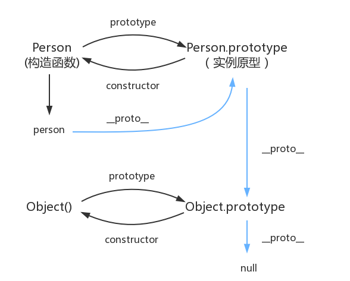

# 原型与原型链
   
> prototype   
每个函数都有一个prototype属性，指向调用该构造函数而创建的实例的原型   

>原型   
可以理解为每一个js对象(null除外)在创建时候来关联的，用来“继承属性”的对象   

>\_\_proto\_\_   
用来表示实例与原型之间的关联。   
每一个js对象(null除外)都具有的，指向该对象原型的一个属性   

>consructor   
每个原型都有一个 constructor 属性指向关联的构造函数   

## 实例与原型
当读取实例的属性时，实例对象内找不到的情况下，会查找与对象关联的原型中的属性，如果还查不到，就去找原型的原型，一直到最顶层为止   
之所以能够这样做，是因为原型也是一个对象，既然是一个对象，它就也是一个构造函数的实例   
   
到了这一步，那么，Object.prototype的原型是什么呢？   
null，没有对象，即此处不应该有值   
所以，查找原型的整个流程就是：   
   
图中的蓝色途径，就是原型链   

# 词法作用域与动态作用域
作用域规定了如何查找变量，也就是确定当前执行代码对变量的访问权限   
js的作用域采用了词法作用域，即静态作用域，函数的作用域在函数定义的时候就已经定义了   
与之相对的动态作用域，是在函数调用的时候才决定的   
之间的区别可以根据这个例子来看：   
```javascript
var value = 1;

function foo() {
    console.log(value);
}

function bar() {
    var value = 2;
    foo();
}

bar(); // 1
// 执行 foo 函数，先从 foo 函数内部查找是否有局部变量 value，如果没有，就根据书写的位置，查找上面一层的代码，也就是 value 等于 1，所以结果会打印 1
// 假设是动态作用域，执行 foo 函数，依然是从 foo 函数内部查找是否有局部变量 value。如果没有，就从调用函数的作用域，也就是 bar 函数内部查找 value 变量，所以结果会打印 2
```   

# 执行上下文栈
js代码的执行并非是一行一行顺序执行，而是一段一段执行，当执行一段代码时，会先进行一些准备工作，比如变量提升和函数提升，这个准备工作，即是执行上下文。   
当 JavaScript 开始要解释执行代码的时候，最先遇到的就是全局代码，所以初始化的时候首先就会向执行上下文栈压入一个全局执行上下文，我们globalContext 表示它，并且只有当整个应用程序结束的时候，ECStack 才会被清空，所以程序结束之前， ECStack 最底部永远有个globalContext。   
当执行一个函数的时候，就会创建一个执行上下文，并且压入执行上下文栈，当函数执行完毕的时候，就会将函数的执行上下文从栈中弹出。   
这个内容仅从定义上可能较难理解，可以看下几个例子：   
```js
function fun3() {
    console.log('fun3')
}

function fun2() {
    fun3();
}

function fun1() {
    fun2();
}

fun1();

// 伪代码

// fun1()
// ECStack.push(<fun1> functionContext);

// fun1中竟然调用了fun2，还要创建fun2的执行上下文
// ECStack.push(<fun2> functionContext);

// 擦，fun2还调用了fun3！
// ECStack.push(<fun3> functionContext);

// fun3执行完毕
// ECStack.pop();

// fun2执行完毕
// ECStack.pop();

// fun1执行完毕
// ECStack.pop();

// javascript接着执行下面的代码，但是ECStack底层永远有个globalContext
```   
```js
var scope = "global scope";
function checkscope(){
    var scope = "local scope";
    function f(){
        return scope;
    }
    return f();
}
checkscope();
// ECStack.push(<checkscope> functionContext);
// ECStack.push(<f> functionContext);
// ECStack.pop();
// ECStack.pop();
```   
```js
var scope = "global scope";
function checkscope(){
    var scope = "local scope";
    function f(){
        return scope;
    }
    return f;
}
checkscope()();
// ECStack.push(<checkscope> functionContext);
// ECStack.pop();
// ECStack.push(<f> functionContext);
// ECStack.pop();
```   

# 变量对象
变量对象是与执行上下文相关的数据作用域，存储了在上下文中定义的变量和函数声明   
## 全局上下文
首先明确全局对象的定义：
>全局对象是预定义的对象，作为 JavaScript 的全局函数和全局属性的占位符。通过使用全局对象，可以访问所有其他所有预定义的对象、函数和属性

即
1. 可以通过 this 引用，在客户端 JavaScript 中，全局对象就是 Window 对象;客户端 JavaScript 中，全局对象有 window 属性指向自身：
   ```js
    var a = 1;
    console.log(window.a);

    this.window.b = 2;
    console.log(this.b);
   ```   
2. 全局对象是由 Object 构造函数实例化的一个对象
3. 预定义了很多函数与属性
4. 作为全局变量的宿主

所以说，全局上下文的变量对象就是全局对象
## 函数上下文
在函数上下文中，用活动对象(AO)来表示变量对象   
活动对象是在进入函数上下文时刻被创建的，它通过函数的 arguments 属性初始化。arguments 属性值是 Arguments 对象   

执行上下文的代码会分为分析和执行两个部分来进行，即：
## 进入执行上下文
代码未执行时，变量对象会包括：
1. 函数的所有形参 (如果是函数上下文)
2. 变量声明（注意未声明的变量不会存在AO中）
3. 函数声明（注意const fun = function(){}这种不是函数声明）
## 代码执行
在代码执行阶段，会顺序执行代码，根据代码，修改变量对象的值   

一个需要注意的题目：   
```js
console.log(foo);// 会打印函数，而不是 undefined 

function foo(){
    console.log("foo");
}

var foo = 1;
// 这是因为在进入执行上下文时，首先会处理函数声明，其次会处理变量声明，如果变量名称跟已经声明的形式参数或函数相同，则变量声明不会干扰已经存在的这类属性
```   

# 作用域链
当查找变量的时候，会先从当前上下文的变量对象中查找，如果没有找到，就会从父级(词法层面上的父级)执行上下文的变量对象中查找，一直找到全局上下文的变量对象，也就是全局对象。这样由多个执行上下文的变量对象构成的链表就叫做作用域链   
函数作用域链可以通过函数创建和函数激活两个过程来进行讲解：   
## 函数创建
函数有一个内部属性 [[scope]]，当函数创建的时候，就会保存所有父变量对象到其中，可以理解 [[scope]] 就是所有父变量对象的层级链，但是注意：[[scope]] 并不代表完整的作用域链（因为只有它的父变量对象）   
## 函数激活
当函数激活时，进入函数上下文，创建 VO/AO 后，就会将活动对象添加到作用链的前端。至此，作用域链创建完毕   
 
# this与call,apply,bind
## this
this是js的一个关键字，通常在函数中进行使用，用来表示上下文对象，与函数被调用的方式有关，它指向谁，是由函数被调用的调用点来决定的。   
所以，this是运行时绑定的，而与编写时的绑定无关。但this总会指向调用函数的那个对象。   
JavaScript 语言之所以有 this 的设计，跟内存里面的数据结构有关系。   
> **js的数据结构**   
js的数据类型共有7种，可分为基本类型与引用类型两类。   
基本数据类型：Undefined,Null,Boolean,Number,String,Symbol(es6新增)   
引用数据类型:Object   
基本数据类型是按值访问的，值不可变，存放在栈内存里面，直接存储变量标识符与变量值，基本类型间的比较是value的比较   
引用数据类型是按引用访问的，值是可变的。引用类型的比较是引用地址之间的比较。值是保存在堆内存中的对象。栈内存中存储了变量标识符和指向堆内存中的该对象的指针。
   
js允许在函数内部，引用当前环境的其他变量。由于函数可以在不同上下文执行，就需要有一种机制，能够在函数体内部获得当前的运行环。所以，this就出现了，它的设计目的就是在函数体内部，指代函数当前的运行环境。   
情况1：如果一个函数中有this，但是它没有被上一级的对象所调用，那么this指向的就是window，这里需要说明的是在js的严格版中this指向的不是window。   
> 严格模式下，全局作用域中的this指向的是window，全局作用域中函数中的this，指向的是undefined，还有些特殊时候，不再赘述。es6箭头函数中的this都指向window。
   
> 构造函数中的this，是因为new关键字改变了this指向的原因
   
情况2：如果一个函数中有this，这个函数有被上一级的对象所调用，那么this指向的就是上一级的对象。   
情况3：如果一个函数中有this，这个函数中包含多个对象，尽管这个函数是被最外层的对象所调用，this指向的也只是它上一级的对象。  
```js
var o = {
    a:10,
    b:{
        a:12,
        fn:function(){
            console.log(this.a); //12
        }
    }
}
o.b.fn();
```   
```js
var o = {
    a:10,
    b:{
        a:12,
        fn:function(){
            console.log(this.a); //undefined
            console.log(this); //window
        }
    }
}
var j = o.b.fn;
j();
```   
而有时候，我们需要绑定函数内的this指向，这时，就有几种方法来达成目的：使用箭头函数的话，this默认指向window对象，而要指向制定上下文对象的话，就有call,apply,bind方法可以使用：   
## call   
语法：fun.call(thisArg, arg1, arg2, ...)   
call()和apply()类似，区别在于，call接受若干参数，apply接受的是一个包含多个参数的数组。   
  
```javascript
Function.prototype.myCall = function(context) {
  context = context ? Object(context) : window
  context.fn = this;//这个this指的是要调用的函数
  // 下面这一句用了es6的语法，还能使用es5来实现：Array.from(arguments).slice(1)
  let args = [...arguments].slice(1)
  let r = context.fn(args)
  delete context.fn
  return r
}
```
## apply   
语法：func.apply(thisArg, [argsArray])   
apply()调用一个指定this值的函数, 接收作为一个数组或者类数组对象提供的参数   
  
```javascript
Function.prototype.myApply = function(context) {
  context = context ? Object(context) : window
  context.fn = this
  let args = arguments[1]
  if (!args) {
      return context.fn()
  }
  let r = context.fn(args)
  delete context.fn;
  return r
}
```   
## bind   
语法：function.bind(thisArg, [arg1[, arg2[, ...]]])   
bind返回的是一个函数，所以不会像call和apply那样直接获得函数执行后的结果。   
借用apply来简易实现，只实现对this的绑定：   
  
```javascript
Function.prototype.bind = function(context) {
  let _me = this
    return function() {
        return _me.apply(context)
    }
}
```
但是bind也支持多次传参，比如：
```javascript
let obj = {
    name: 'joker'
}

function fn(name, age) {
    console.log(this.name + '今年' + name + age + '岁了')
}
let bindFn = fn.bind(obj, '大概')
bindFn(10)
// joker今年大概10岁了
```
所以将上面的实现进行完善：
```javascript
Function.prototype.bind = function(context) {
    let _me = this
    let bindArgs = [].slice.call(arguments, 1) // 获取bind方法传入的参数
    return function() {
        let fnArgs = [].slice.call(arguments) // 获取函数执行传入的参数
        return _me.apply(context, bindArgs.concat(fnArgs))
    }
}
```   

# 类数组对象   
在上面用到的arguments，可以获取所有传入的参数，这是一个类数组对象。   
所谓的类数组对象，是一个拥有length属性和若干索引属性的对象，并非一个数组。它们之间的关系和区别，近似于：   
```javascript
var array = ['name', 'age', 'sex'];

var arrayLike = {
    0: 'name',
    1: 'age',
    2: 'sex',
    length: 3
}
```
而称之为类数组对象的原因，是因为它在读写，获取长度这些方面，和真正的数组没有区别。而“类”的原因，则是因为它毕竟不是数组，不能调用数组方法。   
这也不是绝对的，可以通过call方法间接调用：   
```javascript
Array.prototype.join.call(arrayLike, '&');
```
类数组也能转化为数组，有以下方法：
```javascript
// 1. slice
Array.prototype.slice.call(arrayLike); // ["name", "age", "sex"] 
// 2. splice
Array.prototype.splice.call(arrayLike, 0); // ["name", "age", "sex"] 
// 3. ES6 Array.from
Array.from(arrayLike); // ["name", "age", "sex"] 
// 4. apply
Array.prototype.concat.apply([], arrayLike);
```
## arguments
   
1. arguments的length属性表示实参的长度；   
2. callee属性能够调用函数本身，可以借此解决一个闭包经典问题：   
  
    ```javascript
    var data = [];

    for (var i = 0; i < 3; i++) {
        (data[i] = function () {
          console.log(arguments.callee.i) 
        }).i = i;
    }

    data[0]();
    data[1]();
    data[2]();

    // 0
    // 1
    // 2
    ```
3. arguments和对应参数的绑定问题   
    传入的参数，实参和 arguments 的值会共享，当没有传入时，实参与 arguments 值不会共享。   
    除此之外，以上是在非严格模式下，如果是在严格模式下，实参和 arguments 是不会共享的。   
  
    ```javascript
    function foo(name, age, sex, hobbit) {

        console.log(name, arguments[0]); // name name

        // 改变形参
        name = 'new name';

        console.log(name, arguments[0]); // new name new name

        // 改变arguments
        arguments[1] = 'new age';

        console.log(age, arguments[1]); // new age new age

        // 测试未传入的是否会绑定
        console.log(sex); // undefined

        sex = 'new sex';

        console.log(sex, arguments[2]); // new sex undefined

        arguments[3] = 'new hobbit';

        console.log(hobbit, arguments[3]); // undefined new hobbit

    }

    foo('name', 'age')
    ```

# 闭包
闭包是指那些能够访问自由变量的函数   
>自由变量是指在函数中使用的，但既不是函数参数也不是函数的局部变量的变量   

而从实践角度上而言，满足以下两点的才是闭包：   
* 即使创建它的上下文已经销毁，它仍然存在（比如，内部函数从父函数中返回）
* 在代码中引用了自由变量   

>闭包的形成机制   
涉及到上面的作用域链：当我们调用一个闭包函数时，因为函数执行时，其上下文有个Scope属性，该属性作为一个作用域链包含有该函数被定义时所有外层的变量对象的引用，所以定义了闭包的函数虽然销毁了，但是其变量对象依然被绑定在闭包函数上，保留在内存中.   

通过下面这道题来理一下闭包的实现：
```javascript
var data = [];

for (var i = 0; i < 3; i++) {
  data[i] = function () {
    console.log(i);
  };
}

data[0]();// 3
data[1]();// 3
data[2]();// 3
```
结果都是3的原因，可根据代码的执行上下文得出：   
执行到data[0]()之前，全局上下文的变量对象为：
```javascript
globalContext = {
    VO: {
        data: [...],
        i: 3
    }
}
```
执行到data[0]时，它的作用域链为：
```javascript
data[0]Context = {
    Scope: [AO, globalContext.VO]
}
```
data[0]Context 的 AO 并没有 i 值，所以会从globalContext.VO 中查找，i 为 3，所以打印的结果就是 3。data[1]，data[2]同理。   
而将上面代码改为闭包实现：
```javascript
var data = [];

for (var i = 0; i < 3; i++) {
  data[i] = (function (i) {
        return function(){
            console.log(i);
        }
  })(i);
}

data[0]();// 0
data[1]();// 1
data[2]();// 2
```
执行到data[0]之前的全局上下文变量对象还是和之前一样，但是执行到data[0]时，它的作用域链为：   
```javascript
data[0]Context = {
    Scope: [AO, 匿名函数Context.AO globalContext.VO]
}

匿名函数Context = {
    AO: {
        arguments: {
            0: 0,
            length: 1
        },
        i: 0
    }
}
```
data[0]Context 的 AO 并没有 i 值，所以会沿着作用域链从匿名函数 Context.AO 中查找，这时候就会找 i 为 0，找到了就不会往 globalContext.VO 中查找了，即使 globalContext.VO 也有 i 的值(值为3)，所以打印的结果就是0。data[1]，data[2]同理。

# 垃圾回收
js垃圾回收机制的原因：   
由于字符串、对象和数组没有固定大小，所有当他们的大小已知时，才能对他们进行动态的存储分配。JavaScript程序每次创建字符串、数组或对象时，解释器都必须分配内存来存储那个实体。只要像这样动态地分配了内存，最终都要释放这些内存以便他们能够被再用，否则，JavaScript的解释器将会消耗完系统中所有可用的内存，造成系统崩溃。   
垃圾回收的两种机制：   
* 引用计数   
   不太常见，跟踪记录每个值被引用的次数。当声明了一个变量并将一个引用类型赋值给该变量时，则这个值的引用次数就是1。相反，如果包含对这个值引用的变量又取得了另外一个值，则这个值的引用次数就减1。当这个引用次数变成0时，则说明没有办法再访问这个值了，因而就可以将其所占的内存空间给收回来。这样，垃圾收集器下次再运行时，它就会释放那些引用次数为0的值所占的内存。   
   但是它有一个漏洞，就是循环引用：   
   ```js
    function problem() {
        var objA = new Object();
        var objB = new Object();

        objA.someOtherObject = objB;
        objB.anotherObject = objA;
    }
   ```   
   在这个例子中，objA和objB通过各自的属性相互引用；也就是说这两个对象的引用次数都是2。在采用引用计数的策略中，由于函数执行之后，这两个对象都离开了作用域，函数执行完成之后，objA和objB还将会继续存在，因为他们的引用次数永远不会是0。这样的相互引用如果说很大量的存在就会导致大量的内存泄露。   
* 标记清除   
   最常用的垃圾回收方式。当变量进入执行环境是，就标记这个变量为“进入环境”。从逻辑上讲，永远不能释放进入环境的变量所占用的内存，因为只要执行流进入相应的环境，就可能会用到他们。当变量离开环境时，则将其标记为“离开环境”。   

不过虽然有垃圾回收机制，还是有一些不当操作会引起内存泄漏：   
* 意外的全局变量引起的内存泄露（运行时的全局变量不会被回收）
* 闭包引起的内存泄露
* 没有清楚的dom元素引用
* 被遗忘的定时器

# 内存管理
   
JS内存空间分为栈(stack)，堆(heap)，池(一般也会归类为栈中)，其中栈存放变量，堆存放复杂对象，池存放常量。   
JS中的基本数据类型（Number,String,Boolean,null,undefined,Symbol），这些值都有固定的大小，往往都保存在栈内存中（闭包除外），由系统自动分配存储空间。
>闭包中的变量并不保存在栈内存中，而是保存在堆内存中。考虑到上面的执行上下文，闭包函数的创建上下文销毁之后，所引用的自由变量仍然保留在存储在堆中的[[scope]]作用域链对象属性里   

引用数据类型(Object)的值则都是按引用访问的。这里的引用，我们可以粗浅地理解为保存在栈内存中的一个地址，该地址与堆内存的实际值相关联。   

# 深浅拷贝
区别引用赋值与深浅拷贝，引用赋值是将数组或对象的堆内地址赋值给变量，导致修改的是同一地址的数据。而深浅拷贝是拷贝层级问题。   
## 数组的浅拷贝
我们可以利用数组的一些方法，如   
slice、concat来进行数组的拷贝：   
```javascript
var arr = ['old', 1, true, null, undefined];

var new_arr = arr.concat();
// 或者 var new_arr = arr.slice();

new_arr[0] = 'new';

console.log(arr) // ["old", 1, true, null, undefined]
console.log(new_arr) // ["new", 1, true, null, undefined]
```   

但是，当这个数组内部嵌套了数组或者对象的时候：
```javascript
var arr = [{old: 'old'}, ['old']];

var new_arr = arr.concat();

arr[0].old = 'new';
arr[1][0] = 'new';

console.log(arr) // [{old: 'new'}, ['new']]
console.log(new_arr) // [{old: 'new'}, ['new']]
```
所以说，这种拷贝方法并不彻底。   
如果数组元素是基本类型，就会拷贝一份，互不影响，而如果是对象或者数组，就会只拷贝对象和数组的引用，这样我们无论在新旧数组进行了修改，两者都会发生变化。这种拷贝方式就是浅拷贝，与之相对的就是深拷贝，将数组和对象每一层的值都拷贝独立开来。
> Object.assign()，{ ...obj }都是对象的浅拷贝   
   
## 深拷贝   
实现深拷贝的方法有一下几种：
### JSON序列化方法   
JSON.parse(JSON.stringify(obj))   
方便快捷，但是这个方法有很多问题：
* 无法实现对函数 、RegExp等特殊对象的克隆；
* 会抛弃对象的constructor,所有的构造函数会指向Object；
* 对象有循环引用,会报错；
* 相同的引用会被重复复制。
###  迭代递归   
```javascript
function clone(source) {
  if (typeof source !== 'object') return source;
  var target = Array.isArray(source) ? [] : {};
  for(var i in source) {
    if (source.hasOwnProperty(i)) {
      if (typeof source[i] === 'object') {
        target[i] = clone(source[i]); // 注意这里
      } else {
        target[i] = source[i];
      }
    }
  }
  return target;
}
```
这个方式还有一个致命问题，就是循环引用没有解决。
### jq的extend方法   
jq中定义的extend()也能实现深拷贝，手动实现：   
```javascript
var class2type = {};
var toString = class2type.toString;
var hasOwn = class2type.hasOwnProperty;

function isPlainObject(obj) {
  var proto, Ctor;
  if (!obj || toString.call(obj) !== "[object Object]") {
    return false;
  }
  proto = Object.getPrototypeOf(obj);
  if (!proto) {
    return true;
  }
  Ctor = hasOwn.call(proto, "constructor") && proto.constructor;
  return typeof Ctor === "function" && hasOwn.toString.call(Ctor) === hasOwn.toString.call(Object);
}


function extend() {
  // 默认不进行深拷贝
  var deep = false;
  var name, options, src, copy, clone, copyIsArray;
  var length = arguments.length;
  // 记录要复制的对象的下标
  var i = 1;
  // 第一个参数不传布尔值的情况下，target 默认是第一个参数
  var target = arguments[0] || {};
  // 如果第一个参数是布尔值，第二个参数是 target
  if (typeof target == 'boolean') {
    deep = target;
    target = arguments[i] || {};
    i++;
  }
  // 如果target不是对象，我们是无法进行复制的，所以设为 {}
  if (typeof target !== "object" && !isFunction(target)) {
    target = {};
  }

  // 循环遍历要复制的对象们
  for (; i < length; i++) {
    // 获取当前对象
    options = arguments[i];
    // 要求不能为空 避免 extend(a,,b) 这种情况
    if (options != null) {
      for (name in options) {
        // 目标属性值
        src = target[name];
        // 要复制的对象的属性值
        copy = options[name];

        // 解决循环引用
        if (target === copy) {
          continue;
        }

        // 要递归的对象必须是 plainObject 或者数组
        if (deep && copy && (isPlainObject(copy) ||(copyIsArray = Array.isArray(copy)))) {
          // 要复制的对象属性值类型需要与目标属性值相同
          if (copyIsArray) {
            copyIsArray = false;
            clone = src && Array.isArray(src) ? src : [];

          } else {
            clone = src && isPlainObject(src) ? src : {};
          }

          target[name] = extend(deep, clone, copy);

        } else if (copy !== undefined) {
          target[name] = copy;
        }
      }
    }
  }
  return target;
};
```

# for...in与for..of   
## for...in   
for in 应用于数组循环返回的是数组的下标和数组的属性和原型上的方法和属性，而for in应用于对象循环返回的是对象的属性名和原型中的方法和属性。   
for...in遍历数组的问题：   
   1. index索引为字符串型数字，不能直接进行几何运算；
   2. 遍历顺序有可能不是按照实际数组的内部顺序；   
   3. 使用for in会遍历数组所有的可枚举属性，包括原型。例如上栗的原型方法method和name属性。可以用hasOwnProperty()方法来筛选。   
## for...of   
for...of遍历的是数组元素值。

所以使用for...in遍历对象，使用for...of遍历数组。

# 继承
## 原型链实现继承   
      
```javascript
function Father(){
  this.fproperty = true;
}
Father.prototype.getFatherValue = function(){
  return this.fproperty;
}
function Son(){
  this.sonProperty = false;
}
//继承 Father
Son.prototype = new Father();//Son.prototype被重写,导致Son.prototype.constructor也一同被重写
Son.prototype.getSonVaule = function(){
  return this.sonProperty;
}
var instance = new Son();
console.log(instance.getFatherValue());//true
```   
但是原型链继承还是有明显的缺点的：   
* 当原型链中包含引用类型值的原型时,该引用类型值会被所有实例共享;
* 在创建子类型(例如创建Son的实例)时,不能向超类型(例如Father)的构造函数中传递参数.   
因此，实践中原型链继承方法使用的还是较少。
## 借用构造函数
     
为了解决原型链的两个问题，使用了借用构造函数，也叫做经典继承。   
基本思想就是，在子类型的构造函数内部调用超类构造函数。  
  
```javascript
function Father(){
  this.colors = ["red","blue","green"];
}
function Son(){
  Father.call(this);//继承了Father,且向父类型传递参数
}
var instance1 = new Son();
instance1.colors.push("black");
console.log(instance1.colors);//"red,blue,green,black"
var instance2 = new Son();
console.log(instance2.colors);//"red,blue,green" 可见引用类型值是独立的
```
可以，看出使用借用构造函数方法，一举解决了原型链的两个问题。   
但是，同时也引入了新的问题：  
* 原型链上只有子类，不完整； 
* 方法都在构造函数中定义, 因此函数复用也就不可用了；
* 超类型(如Father)中定义的方法,对子类型而言也是不可见的。   
所以，借用构造函数方法也使用较少。
## 组合继承   
     
也叫做伪经典继承。将原型链和借用构造函数的技术组合到一块,从而发挥两者之长的一种继承模式。   
使用原型链实现对原型属性和方法的继承,通过借用构造函数来实现对实例属性的继承。这样，即既通过在原型上定义方法实现了函数复用，又能保证每个实例拥有自己的属性。   
  
```javascript
function Father(name){
  this.name = name;
  this.colors = ["red","blue","green"];
}
Father.prototype.sayName = function(){
  alert(this.name);
};
function Son(name,age){
  Father.call(this,name);//继承实例属性，第一次调用Father()
  this.age = age;
}
Son.prototype = new Father();//继承父类方法,第二次调用Father()
Son.prototype.sayAge = function(){
  alert(this.age);
}
var instance1 = new Son("louis",5);
instance1.colors.push("black");
console.log(instance1.colors);//"red,blue,green,black"
instance1.sayName();//louis
instance1.sayAge();//5

var instance1 = new Son("zhai",10);
console.log(instance1.colors);//"red,blue,green"
instance1.sayName();//zhai
instance1.sayAge();//10
```   
组合继承完成了对原型链和借用构造函数的优点的融合，也是js中最常用的继承模式。而且, instanceof 和 isPrototypeOf( )也能用于识别基于组合继承创建的对象。   
不过，它也有一个可改进的地方，就是两次调用父类构造函数，造成了不必要的消耗。   
## 原型式继承   
下面介绍如何根据已有的对象实现继承。原型式继承就是其中一种。   
先创建一个临时性的构造函数, 然后将传入的对象作为这个构造函数的原型,最后返回了这个临时类型的一个新实例。   
  
```javascript
function object(obj) {
  function F(){};
  F.prototype = o;
  return new F();
}
```   
object本质上对传入其中的对象进行了一次浅复制，所有实例都共享属性。   
在ES5中，新增了Object.create()方法规范了原型式继承。   
Object.create()有两个参数：
* 一个用作新对象原型的对象；
* （可选）一个为新对象定义额外属性来拓展的对象。
## 寄生式继承   
与原型式继承紧密相连的一种思路。创建一个仅用于封装继承过程的函数,该函数在内部以某种方式来增强对象,最后再像真的是它做了所有工作一样返回对象。   
     
```javascript
function createAnother(original){
  var clone = object(original);//通过调用object函数创建一个新对象
  clone.sayHi = function(){//以某种方式来增强这个对象
    alert("hi");
  }
  return clone;//返回这个对象
}
```   
使用寄生式继承来为对象添加函数, 会由于不能做到函数复用而降低效率;这一点与构造函数模式类似。
## 寄生组合式继承   
寄生组合式继承就是为了降低组合继承调用父类构造函数的开销而出现的。   
基本思路是不必为了指定子类型的原型而调用超类型的构造函数。   
     
```javascript
function extend(subClass,superClass){
var prototype = object(superClass.prototype);//创建对象，superClass.prototype是superClass的一个实例
prototype.constructor = subClass;//增强对象，将constructor指向subClass构造函数
subClass.prototype = prototype;//指定对象
}
```   

# new操作符
除了箭头函数之外的任何函数，都能够使用new来调用。（箭头函数中没有 [[Construct]] 方法，不能使用 new 调用，会报错）   
先看几个例子：   
1. 无return语句   
      构造函数最后没有 return 语句，这也是使用构造函数时默认情况，最后会返回一个新对象：   
      ```javascript
      function Foo(age) {
      this.age = age;
      }

      var o = new Foo(111);
      console.log(o);// {age: 111}
      ```
2. return对象类型数据   
      构造函数最后return对象类型数据：
      ```javascript
      function Foo(age) {
        this.age = age;

        return { type: "我是显式返回的" };
      }

      var o = new Foo(222);
      console.log(o);// {type: '我是显式返回的'}
      ```
3. return基本类型数据   
     
      ```javascript
      function Foo(age) {
        this.age = age;

        return 1;
      }

      var o = new Foo(333);
      console.log(o);// {age: 333}
      ```
为什么会有这样的区别呢？这就涉及到了new操作的背后原理：   
1）创建新对象 o；   
2）给新对象的内部属性赋值，关键是给[[Prototype]]属性赋值，构造原型链（如果构造函数的原型是 Object 类型，则指向构造函数的原型；不然指向 Object 对象的原型）；   
3）执行函数 Foo，执行过程中内部 this 指向新创建的对象 o；   
4）如果 Foo 内部显式返回对象类型数据，则，返回该数据，执行结束；不然返回新创建的对象 o。   
基本实现：
     
```javascript
function fnNew(obj){
  var oResult = {};
  oResult.__proto__ = obj.prototype;
  obj.call(oResult);
  return oResult;
}
```
详细实现：
     
```javascript
/**
* 模拟实现 new 操作符
* @param  {Function} ctor [构造函数]
* @return {Object|Function|Regex|Date|Error}      [返回结果]
*/
function newOperator(ctor){
  if(typeof ctor !== 'function'){
    throw 'newOperator function the first param must be a function';
  }
  // ES6 new.target 是指向构造函数
  newOperator.target = ctor;
  // 1.创建一个全新的对象，
  // 2.并且执行[[Prototype]]链接
  // 4.通过`new`创建的每个对象将最终被`[[Prototype]]`链接到这个函数的`prototype`对象上。
  var newObj = Object.create(ctor.prototype);
  // ES5 arguments转成数组 当然也可以用ES6 [...arguments], Aarry.from(arguments);
  // 除去ctor构造函数的其余参数
  var argsArr = [].slice.call(arguments, 1);
  // 3.生成的新对象会绑定到函数调用的`this`。
  // 获取到ctor函数返回结果
  var ctorReturnResult = ctor.apply(newObj, argsArr);
  // 小结4 中这些类型中合并起来只有Object和Function两种类型 typeof null 也是'object'所以要不等于null，排除null
  var isObject = typeof ctorReturnResult === 'object' && ctorReturnResult !== null;
  var isFunction = typeof ctorReturnResult === 'function';
  if(isObject || isFunction){
      return ctorReturnResult;
  }
  // 5.如果函数没有返回对象类型`Object`(包含`Functoin`, `Array`, `Date`, `RegExg`, `Error`)，那么`new`表达式中的函数调用会自动返回这个新的对象。
  return newObj;
}

function newOperator(ctor){
  if(typeof ctor !== 'function'){
    throw 'newOperator function the first param must be a function';
  }
  newOperator.target = ctor;
  var newObj = Object.create(ctor.prototype);
  var argsArr = [].slice.call(arguments, 1);
  var ctorReturnResult = ctor.apply(newObj, argsArr);
  var isObject = typeof ctorReturnResult === 'object' && ctorReturnResult !== null;
  var isFunction = typeof ctorReturnResult === 'function';
  if(isObject || isFunction){
      return ctorReturnResult;
  }
  return newObj;
}
```   

# React相关
### React Hooks   
提出hooks的原因：   
1. 代码重用   
   在hooks出来之前，常见的代码重用方式是HOCs和render props，这两种方式带来的问题是：你需要解构自己的组件，非常的笨重，同时会带来很深的组件嵌套
2. 复杂的组件逻辑   
   逻辑分散在各处，开发者去维护这些代码会分散自己的精力，理解代码逻辑也很吃力
3. class组件的困惑   
   基于class的组件难以优化   

因此，在18年的React开发者大会上，提出了Hooks的提案，它具有以下的特点：   
1. 无痛接入，不破坏现有的项目结构；   
2. 完全向后兼容；   
3. 现在就能使用(目前在alpha版本中，有望在16.7正式发布)   

不过，hooks也有一些限制：   
1. 只能在函数组件中使用；   
2. 只能在顶层调用，不能在for循环，if判断或函数嵌套中使用。   

几个比较常用的hook：   
* useState   
   让开发者能够在函数组件里面拥有state，修改state
* useEffect   
   让函数组件有处理副作用的能力
* useContext   
   允许将状态在组件树中传递，可以很方便地把context中的值提取出来   

hooks的原理：   
[React Hooks:not magic, just arrays](https://medium.com/@ryardley/react-hooks-not-magic-just-arrays-cd4f1857236e)   
[中文版](https://zhuanlan.zhihu.com/p/51356920)   
hooks的本质其实就是数组实现，按照cursor来逐一取用，所以顺序才这么重要，也是不能在条件、循环中使用的原因。   
简单实现：   
```javascript
let state = [];
let setters = [];
let firstRun = true;
let cursor = 0;

function createSetter(cursor) {
  return function setterWithCursor(newVal) {
    state[cursor] = newVal;
  };
}

// This is the pseudocode for the useState helper
export function useState(initVal) {
  if (firstRun) {
    state.push(initVal);
    setters.push(createSetter(cursor));
    firstRun = false;
  }

  const setter = setters[cursor];
  const value = state[cursor];

  cursor++;
  return [value, setter];
}

// Our component code that uses hooks
function RenderFunctionComponent() {
  const [firstName, setFirstName] = useState("Rudi"); // cursor: 0
  const [lastName, setLastName] = useState("Yardley"); // cursor: 1

  return (
    <div>
      <Button onClick={() => setFirstName("Richard")}>Richard</Button>
      <Button onClick={() => setFirstName("Fred")}>Fred</Button>
    </div>
  );
}

// This is sort of simulating Reacts rendering cycle
function MyComponent() {
  cursor = 0; // resetting the cursor
  return <RenderFunctionComponent />; // render
}

console.log(state); // Pre-render: []
MyComponent();
console.log(state); // First-render: ['Rudi', 'Yardley']
MyComponent();
console.log(state); // Subsequent-render: ['Rudi', 'Yardley']

// click the 'Fred' button

console.log(state); // After-click: ['Fred', 'Yardley']
```